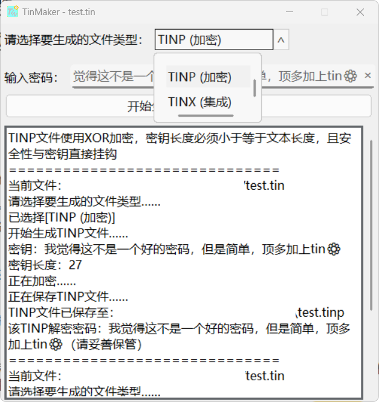

# TinMaker

TinText的Tin文件加密与集成应用。

目前支持的功能

- 基于XOR加密的TINP
- 基于XOR加密的TINX

---

本应用可以选择要生成的文件格式。

根据提示输入密码。

生成对应的文件格式并在原位置按原名存储。

---

## TINP-XOR

基于TinML-TINP-XOR标准。

会随机生成125~255个字符添加在开头一行。

---

## TINX-XOR

基于TinML-TINX-XOR标准。
