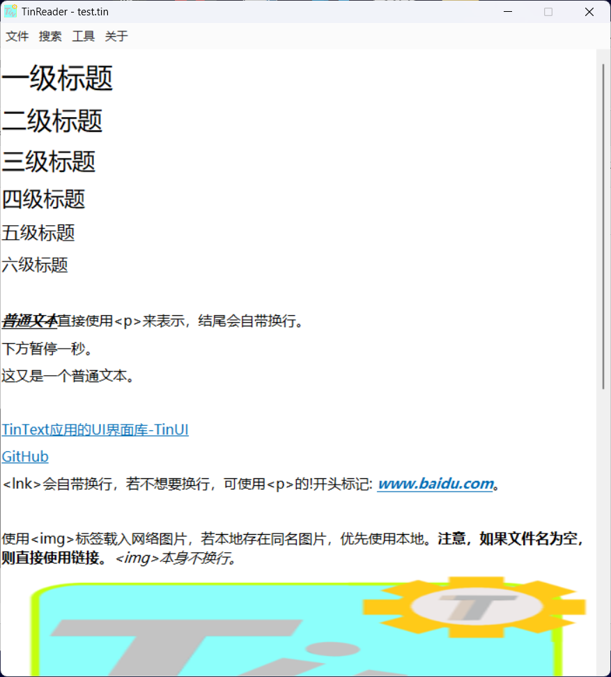
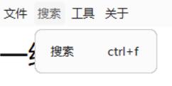
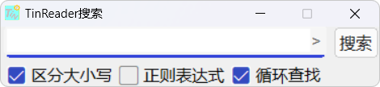
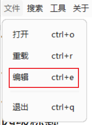
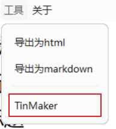
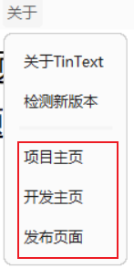

# TinReader

渲染TIN文件，同时能够找到TinText应用组所有功能的入口。

## 阅读器

整个TinReader就是一个阅读器，具体来讲，就是窗口主体控件，用来显示TIN文件。

### 打开文件

在菜单中选择文件操作

### 搜索

在菜单中选择搜索操作

在搜索窗口中可进行详细搜索操作

## 打开编辑

在菜单中选择文件操作，选择编辑操作

## 打开TIN文件加密&集成

在菜单中选择工具操作，选择TinMaker

## 转译

在菜单中选择工具操作，选择要生成的格式文件

TinText支持将TIN标记语言转译为其它格式文件，包括：

- html（原生支持，使用TinTranslator.tin2html）

- markdown（使用html2text）

## 应用页面

在菜单中选择关于操作，查看项目页面

