# TinWriter

TinText的编辑器。

---

## 编辑器

TinWriter编辑器主体为编辑框框，带有简单标记高亮功能。

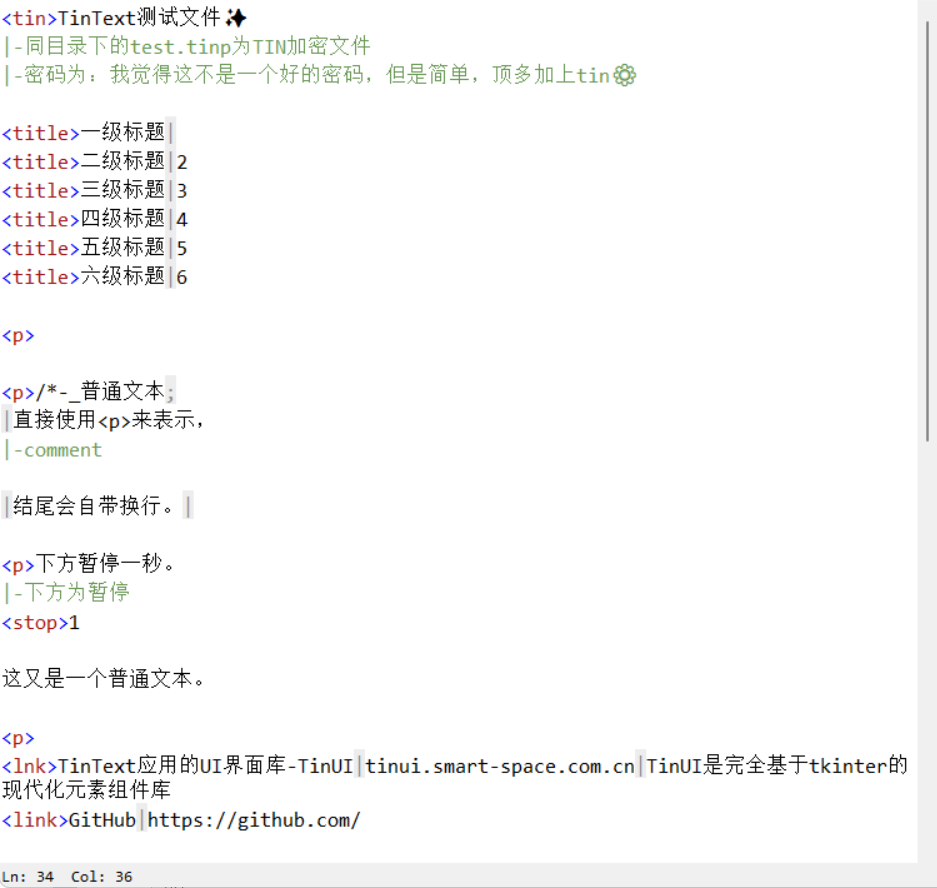

---

## 工具栏

在编辑框上方是工具栏，有若干功能图标。

### 保存

第一个图标按钮为保存文件。文件编辑后会在标题栏显示“\*”。

### 渲染

在TinReader中重新渲染，与TinReader中的“重新渲染”功能一样。

### 另存为

将本文件另存为，但接下里的编辑仍在本文件上进行。

### 搜索与替换

该功能区对应同一个窗口。“搜索窗口”仅包含搜索功能。

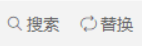

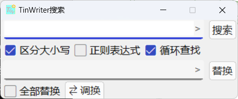

### HTML快捷录入

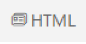

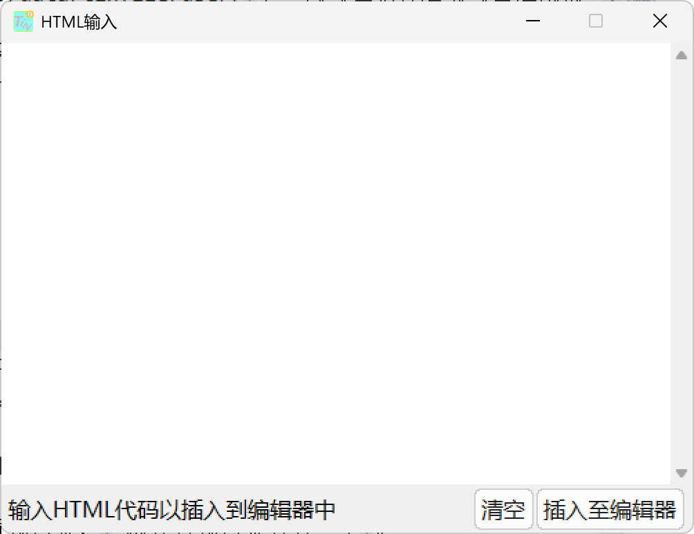

### 表格快捷输入

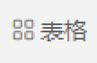

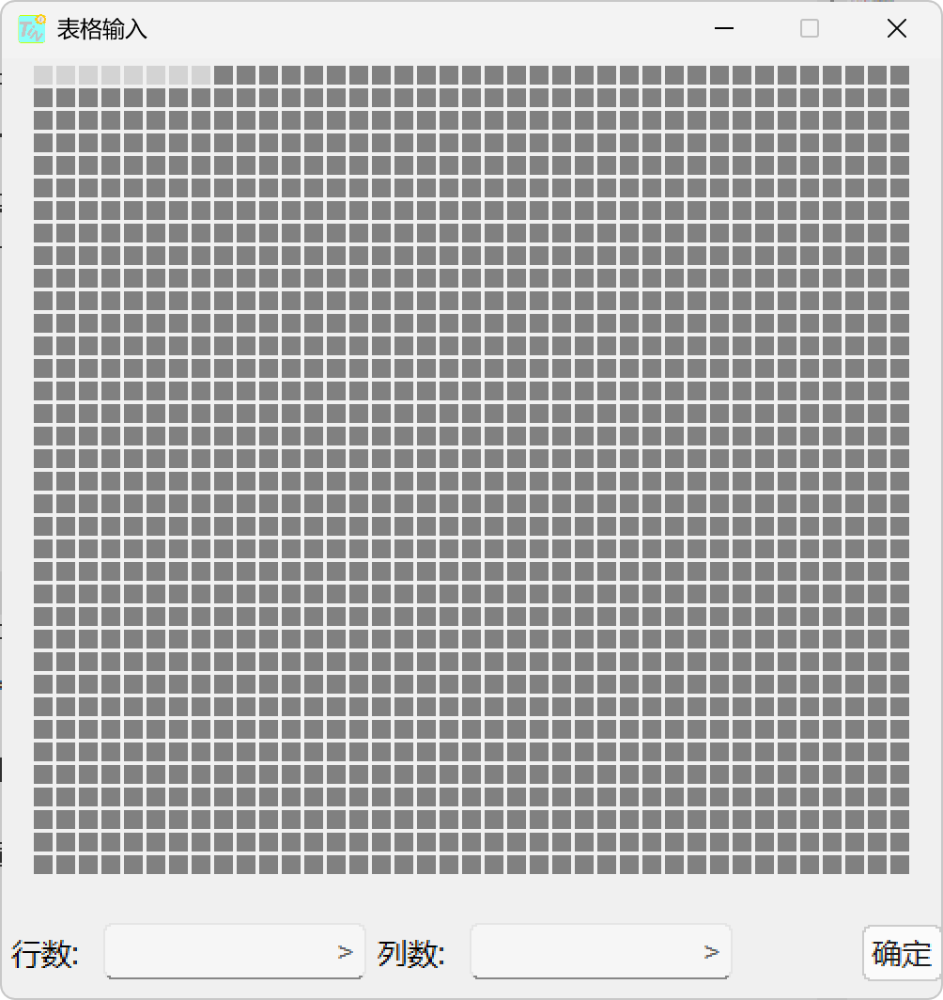

### 代码快捷输入

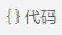

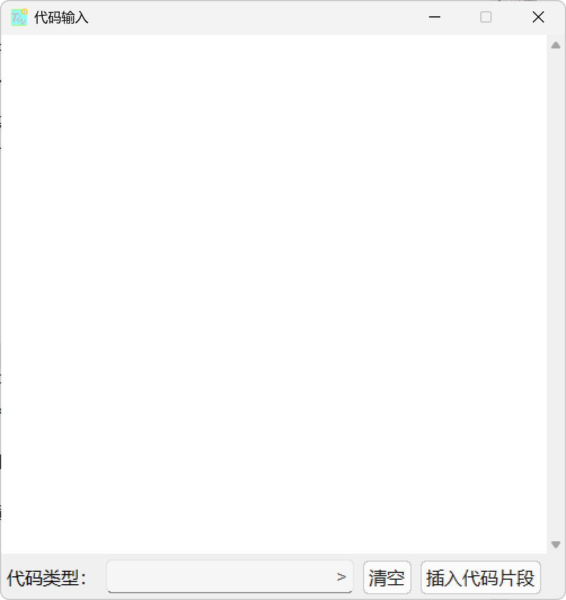

### 图片、TinML文件资源管理器

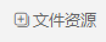

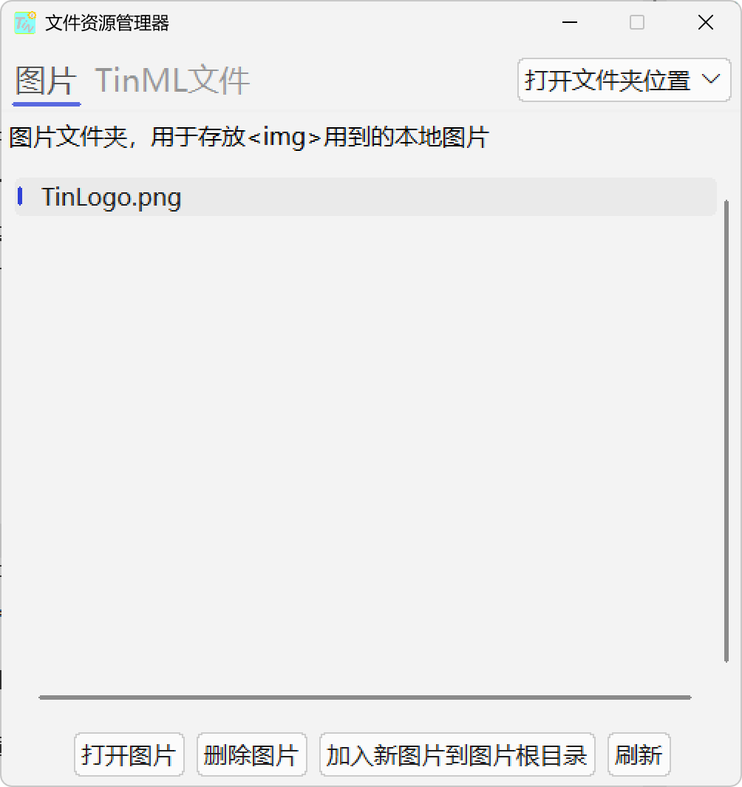

---

## 工具部件

工具部件在TinWriter右上角，里面提供了一些编辑帮助。现在支持：

- 快捷键提示

- 记事本，随意记录

- TINP、TINX生成入口

---

## 提示与快捷输入

### 提示

TinWriter提供简单提示，当光标后显示提示文本时，使用`alt+p`接受建议。

### 快捷输入

以下是快捷输入对照表。

| 快捷键   | 输入内容                               |
| ----- | ---------------------------------- |
| alt+; | ;                                  |
| alt+/ | （切换）注释                             |
| alt+g | 快速生成标签参数                           |
| alt+a | 显示标签说明 |
| alt+. | \<> |

> 当文本处于选中状态时，`alt+/`会注释所有选中的行，若选中第一行为注释，则取消所有行注释。该快捷键为注释切换。
>
> `alt+g`只在光标所在行仅有标签时有效。
>
> `alt+.`只在光标处于行首时有效。
